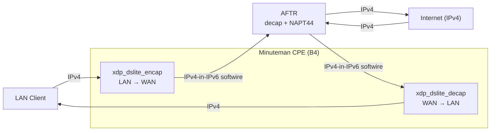
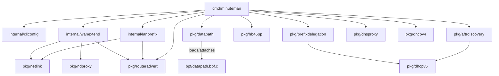

# Minuteman

A high-performance CPE gateway for home use, built on XDP/eBPF. Minuteman
aims to be a practical, production-usable home-gateway datapath — DS-Lite (RFC 6333) IPv4-over-IPv6
tunneling, automatic AFTR/prefix discovery, DHCPv6 Prefix Delegation, RFC 4389 Neighbor Discovery
Proxy, a DNS proxy, and a LAN DHCPv4 server — all without spawning any external client/server daemons
(`dhclient`, `radvd`, `ndppd`, `dnsmasq`, `dhcpd`, ...) or shelling out to `ip`/`sysctl`. Every protocol
client/server and every piece of kernel configuration is done in-process, either in the XDP fast path or
in hand-rolled Go using raw sockets and netlink.



The LAN side also gets IPv6, via whichever of `-dhcpv6-pd` or `-ndproxy` matches the ISP (see
[Features](#features) below) — `xdp_dslite_encap` passes all non-IPv4 traffic through untouched, so plain
kernel IPv6 forwarding and this IPv6 provisioning are all that's needed alongside the DS-Lite path above.

## Features

- **DS-Lite (RFC 6333) B4 element**, implemented as an XDP program attached to both the WAN and LAN
  interfaces: encapsulates LAN-originated IPv4 into IPv6 toward an AFTR, decapsulates the return traffic,
  and handles in-datapath PMTU discovery (synthesizing ICMPv4 Fragmentation-Needed replies, tunneled back
  through the softwire when needed) and CPU fan-out for the decap path.
- **AFTR discovery**, no static configuration required: a from-scratch DHCPv6 client (RFC 3736
  Information-Request + RFC 6334 `OPTION_AFTR_NAME`, resolved via DNS) runs at startup, falling back to
  **HB46PP** (JAIPA's HTTP-based IPv4-over-IPv6 provisioning protocol, used by several Japanese ISPs/VNEs
  instead of DHCPv6 AFTR-Name) when the DHCPv6 Reply carries no AFTR-Name.
- **DHCPv6 Prefix Delegation (RFC 3633)**, opt-in via `-dhcpv6-pd`: acquires a delegated IPv6 prefix on the
  WAN interface, carves one `/64` per LAN interface out of it, assigns it via netlink, and serves it to LAN
  clients over Router Advertisements (RFC 4861) so they can SLAAC an address themselves — LAN clients get
  both the DS-Lite IPv4 path and native delegated IPv6.
- **RFC 4389 Neighbor Discovery Proxy**, opt-in via `-ndproxy`, for ISPs that hand out only a single on-link
  `/64` on the WAN with no prefix delegation: learns that `/64` via SLAAC, extends it onto every LAN
  interface (Router Advertisements with the On-Link flag cleared), and actively proxies Neighbor
  Solicitations for LAN hosts on the WAN link — verifying each host is genuinely present via a Neighbor
  Solicitation probe on the LAN side before ever answering for it, rather than trusting passively-snooped
  state.
- **DNS proxy**, opt-in via `-dns-proxy` (RFC 6333's recommendation that the B4 element act as one):
  listens on every LAN interface's gateway IP and forwards queries verbatim, over native IPv6, to the
  DNS server(s) learned via DHCPv6 (or `-dns-server`, if given) — so LAN DNS lookups never take the
  DS-Lite softwire round trip an ordinary tunneled IPv4 DNS query would.
- **DHCPv4 server (RFC 2131/2132)**, opt-in via `-dhcpv4`: hands LAN clients the private IPv4 address the
  DS-Lite softwire carries, plus the CPE as their router (and, paired with `-dns-proxy`, DNS), and an
  interface MTU (option 26) reduced by the tunnel overhead so clients size packets to fit the softwire.
  Each `-lan` interface serves its own subnet (from the `-lan` value's optional `/prefixlen`, default
  `/24`).

## Current status

DS-Lite, AFTR discovery (both DHCPv6 and HB46PP), DHCPv6-PD, NDProxy, the DNS proxy, and the DHCPv4 server
are all implemented and have been verified end-to-end against the `test/netns/` rig (see
[Testing](#testing) below) — XDP programs load, pass the kernel verifier, and process live traffic through
a real (simulated) softwire; the DHCPv4 path is exercised with a real `dhclient` acquiring its lease from
minuteman, and a live capture on the simulated AFTR's decap interface during a DNS-proxied query confirmed
zero packets ever cross the softwire for it.

Not yet implemented:
- The migration technologies other than DS-Lite that an HB46PP response can describe (`map_e`, `map_t`,
  `lw4o6`, `464xlat`, `ipip`). The response decoder already preserves their parameter objects, so adding
  one is a matter of a new typed struct, a new datapath, and extending the capability request.
- Periodic re-discovery of the AFTR after the initial one at startup (both `pkg/aftrdiscovery` and
  `pkg/hb46pp` report a refresh interval, but nothing acts on it yet) — unlike the WAN's own SLAAC prefix
  under `-ndproxy`, which *is* re-learned if it changes (`internal/wanextend.WatchChanges`).

## Requirements

- A Linux kernel with `CONFIG_DEBUG_INFO_BTF=y` (i.e. `/sys/kernel/btf/vmlinux` present) and native/driver
  XDP support on the interfaces you attach to.
- `bpftool` and `clang` on `PATH` for the build.
- Go 1.26.2. The module path is `github.com/shun159/miniteman` — note the missing `n` (`miniteman`, not
  `minuteman`), a pre-existing typo in `go.mod`; match it exactly if importing any package.
- `CAP_BPF`/`CAP_NET_ADMIN` (root, or equivalent capabilities) to run the built binary — loading an XDP
  program and managing netlink addresses/routes both need it.

## Build

```sh
make            # regenerates BPF Go bindings, then builds bin/minuteman
make build-bpf  # generates bpf/vmlinux.h if missing, then runs `go generate ./pkg/...` (bpf2go)
make clean      # removes bpf/vmlinux.h, bin/*, *.o, and the generated pkg/datapath/bpf_x86_* files
```

`vmlinux.h` is generated from the running kernel's own BTF, so it's specific to the machine you build on;
delete it (or `make clean`) to regenerate against a different kernel. Cross-compilation is controlled via
`GOOS`/`GOARCH` (default `linux`/`amd64`); `CGO_ENABLED=0` by default. The binary is written to
`bin/minuteman`.

## Usage

```
minuteman -wan <iface> -b4 <ipv6-addr> -lan <iface>=<gateway-ipv4>[,mtu] [-lan ...] [options]
```

| Flag | Description |
|---|---|
| `-wan` | WAN interface name (required) |
| `-b4` | B4 IPv6 address — this CPE's own softwire endpoint (required) |
| `-lan` | LAN interface as `iface=gatewayIP[/prefixlen][,mtu]`; repeatable, at least one required (the `/prefixlen`, default `/24`, is the DHCPv4 subnet) |
| `-aftr` | AFTR IPv6 address; if omitted, discovered live via DHCPv6/HB46PP |
| `-wan-dst-mac` | Fallback next-hop MAC on the WAN side, used only if FIB lookup can't resolve one |
| `-stats-interval` | How often to log datapath stats (default `10s`, `0` disables) |
| `-dhcpv6-pd` | Request a delegated IPv6 prefix via DHCPv6-PD and assign one `/64` per `-lan` interface from it (mutually exclusive with `-ndproxy`) |
| `-ndproxy` | Extend the WAN interface's own SLAAC `/64` onto every `-lan` interface via RFC 4389 Neighbor Discovery Proxy (mutually exclusive with `-dhcpv6-pd`) |
| `-dns-proxy` | Run a DNS proxy on every `-lan` interface's gateway IP, forwarding queries over native IPv6 instead of through the DS-Lite softwire (RFC 6333's B4 SHOULD) |
| `-dns-server` | Upstream DNS server for `-dns-proxy` (repeatable, IPv6 recommended); defaults to the DHCPv6-learned DNS servers if omitted |
| `-dhcpv4` | Run a DHCPv4 server (RFC 2131) on every `-lan` interface, leasing addresses from that interface's subnet with the gateway as router/DNS and a DS-Lite-adjusted MTU |
| `-dhcpv4-lease` | DHCPv4 lease duration (default `12h`) |
| `-dhcpv4-dns` | IPv4 DNS server to advertise to DHCPv4 clients (repeatable); if unset, the `-lan` gateway is advertised when `-dns-proxy` runs, otherwise no DNS is advertised |
| `-hb46pp-vendor-id` | HB46PP `vendorid` query parameter sent during provisioning fallback (default `acde48-minuteman`) |
| `-hb46pp-product` | HB46PP `product` query parameter (default `minuteman`) |
| `-hb46pp-version` | HB46PP `version` query parameter (default `0_1`) |

### Examples

Discover the AFTR live and request a delegated prefix (typical DS-Lite + DHCPv6-PD deployment):

```sh
sudo minuteman -wan eth0 -b4 2001:db8:1::2 -lan eth1=192.168.1.1 -dhcpv6-pd
```

Discover the AFTR live and extend the WAN's own `/64` to the LAN instead (ISP hands out no PD):

```sh
sudo minuteman -wan eth0 -b4 2001:db8:1::2 -lan eth1=192.168.1.1 -ndproxy
```

Pin a static AFTR address (skip discovery entirely), with two LAN interfaces:

```sh
sudo minuteman -wan eth0 -b4 2001:db8:1::2 -aftr 2001:db8:2::1 \
    -lan eth1=192.168.1.1 -lan eth2=192.168.2.1,1400
```

Add a DNS proxy on top of any of the above (here, with DHCPv6-PD and an explicit upstream, since pinning
`-aftr` skips the DHCPv6 exchange `-dns-proxy` would otherwise default to):

```sh
sudo minuteman -wan eth0 -b4 2001:db8:1::2 -aftr 2001:db8:2::1 \
    -lan eth1=192.168.1.1 -dns-proxy -dns-server 2001:4860:4860::8888
```

Serve the LAN a full stack — DS-Lite IPv4, native IPv6 via DHCPv6-PD, DNS forwarding, and DHCPv4 addressing
(the typical all-in-one home-CPE configuration):

```sh
sudo minuteman -wan eth0 -b4 2001:db8:1::2 -lan eth1=192.168.1.1/24 \
    -dhcpv6-pd -dns-proxy -dhcpv4
```

## Architecture



`internal/` (CPE policy) and `pkg/` (reusable protocol/wire-format clients) only ever depend downward, in
that order — `cmd/minuteman` is the only place they're wired together, and no `pkg/` package depends on an
`internal/` one. `pkg/hb46pp` has no internal dependency of its own (its discovery chain is DNS TXT + HTTP,
not DHCPv6), which is why it's a sibling of `pkg/aftrdiscovery` rather than something it depends on.

- **`bpf/`** — the DS-Lite XDP datapath in C (`datapath.bpf.c` + `datapath_helpers.h`), compiled with clang
  and loaded via [cilium/ebpf](https://github.com/cilium/ebpf). Two independently attachable programs:
  `xdp_dslite_encap` on LAN interfaces (IPv4 → IPv6 encapsulation) and `xdp_dslite_decap`/
  `xdp_dslite_decap_cpu` on the WAN interface (IPv6 → IPv4 decapsulation, with optional CPU fan-out).
- **`pkg/datapath/`** — the only package that touches `cilium/ebpf` or BPF map layouts; loads the compiled
  object and exposes `Load`/`AttachWAN`/`AttachLAN`/`SetB4Config`/`SetLANConfig`/`Stats`/`Close`.
- **`pkg/dhcpv6/`** — a generic, stdlib-only DHCPv6 client (RFC 3315/3736), used by both AFTR discovery and
  prefix delegation.
- **`pkg/aftrdiscovery/`** and **`pkg/hb46pp/`** — the two AFTR discovery mechanisms (DHCPv6 AFTR-Name and
  HB46PP provisioning, respectively).
- **`pkg/prefixdelegation/`** — RFC 3633 DHCPv6-PD acquisition and lease maintenance (renew/rebind ladder).
- **`pkg/routeradvert/`** — RFC 4861 Router Advertisement sending (and Router Solicitation, on the WAN side)
  over a hand-rolled raw ICMPv6 socket.
- **`pkg/ndproxy/`** — RFC 4389 Neighbor Discovery Proxy: verifies a target actually exists on the LAN
  before answering Neighbor Solicitations for it on the WAN.
- **`pkg/netlink/`** — a minimal hand-rolled `AF_NETLINK`/`NETLINK_ROUTE` client (address/route
  add/delete/list), no netlink library dependency.
- **`pkg/dnsproxy/`** — the DNS proxy RFC 6333 recommends a DS-Lite B4 element run: forwards LAN DNS
  queries verbatim (no parsing, caching, or rewriting) to upstream servers reachable over native IPv6,
  both UDP and TCP.
- **`pkg/dhcpv4/`** — the LAN-side DHCPv4 server (RFC 2131/2132): a full DORA state machine + lease pool +
  option codec over a raw AF_PACKET socket (needed to reply to a client that has no IP yet). The pure
  logic — wire codec, lease pool, request→reply handler — is unit-tested; the socket I/O is exercised by
  the netns rig.
- **`internal/lanprefix/`** and **`internal/wanextend/`** — the CPE policy layers built on top of the
  protocol packages above: what to actually do with a delegated prefix (`lanprefix`) or a learned WAN
  prefix (`wanextend`) — carving/assigning LAN addresses, driving Router Advertisements, and (for
  `wanextend`) installing per-host routes as `pkg/ndproxy` confirms targets.
- **`internal/cliconfig/`** — CLI flag parsing glue for `cmd/minuteman`.
- **`cmd/minuteman/`** — the CLI entrypoint tying everything above together.

A much more detailed architecture writeup — down to individual file responsibilities and the reasoning
behind specific design decisions — lives in `CLAUDE.md`.

## Testing

### Unit tests

```sh
go test ./...
```

### netns integration rig

`test/netns/` builds a 5-namespace RFC 6333 topology (`mm-host` LAN client → `mm-cpe` running minuteman as
the B4 → `mm-isp` IPv6 access network → `mm-aftr` AFTR simulator → `mm-inet` simulated public IPv4 internet)
to exercise the full datapath end-to-end without physical hardware. Requires root, `dnsmasq`, `kea-dhcp6`,
and a kernel with the `ip6_tunnel` module available (used for the AFTR's IPv4-in-IPv6 decap step). Build
`bin/minuteman` first with `make` from the repo root.

```sh
sudo ./test/netns/setup.sh       # create the namespaces/veths/routing/NAT
sudo ./test/netns/run-cpe.sh     # run bin/minuteman as the B4 inside mm-cpe
sudo ./test/netns/smoketest.sh   # start minuteman itself and verify LAN -> AFTR -> internet connectivity
sudo ./test/netns/teardown.sh    # tear everything down (safe to re-run any time, even after a partial setup)
```

`run-cpe.sh` and `smoketest.sh` omit `-aftr` by default, so minuteman discovers the AFTR live via a real
DHCPv6 exchange against the rig's `mm-isp` dnsmasq/Kea servers. Pass `-aftr <addr>` as an extra argument to
either script to override with a static address instead. `test/netns/common.sh` holds every
namespace/interface/address name used by the rig in one place.

Four environment variables select which of minuteman's discovery/provisioning paths the rig exercises,
independently of each other:

- `MM_AFTR_DISCOVERY=dhcpv6` (default) or `hb46pp` — how the AFTR's address is published: a real RFC 6334
  `OPTION_AFTR_NAME` over DHCPv6, or a JAIPA HB46PP provisioning server reached via a `4over6.info` TXT
  record.
- `MM_WAN_MODEL=dhcpv6-pd` (default) or `ndproxy` — how the LAN gets IPv6 reachability: a real DHCPv6-PD
  delegation, or the WAN's own SLAAC `/64` extended onto the LAN via RFC 4389 proxying.
- `MM_DNS_PROXY=0` (default) or `1` — whether minuteman is also started with `-dns-proxy`; the smoketest
  then has the LAN client resolve a domain through minuteman's DNS proxy (UDP and TCP) instead of directly
  against the rig's DNS server, and checks the answer matches.
- `MM_DHCPV4=0` (default) or `1` — whether minuteman is also started with `-dhcpv4`; the rig then leaves the
  LAN client without a static IPv4 and has it acquire its address, default route, and MTU from minuteman's
  DHCPv4 server via a real `dhclient` before the DS-Lite data-path checks run.

```sh
sudo MM_AFTR_DISCOVERY=hb46pp ./test/netns/setup.sh   # exercise the HB46PP fallback instead
sudo MM_WAN_MODEL=ndproxy ./test/netns/setup.sh       # exercise NDProxy instead of DHCPv6-PD
sudo MM_DNS_PROXY=1 ./test/netns/setup.sh             # also exercise the DNS proxy
sudo MM_DHCPV4=1 ./test/netns/setup.sh                # also exercise the DHCPv4 server
```
